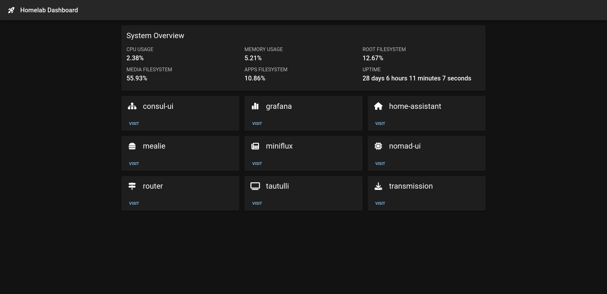

# `homelab-dashboard`

> A dashboard for my homelab



## Install

```bash
pnpm i
```

## Getting Started

First, run the development server:

```bash
pnpm dev
```

Open [http://localhost:3000](http://localhost:3000) with your browser to see the result.

## Usage with Docker

1. Build the container: `docker build -t homelab-dashboard .`
2. Run the container: `docker run -p 3000:3000 homelab-dashboard`
